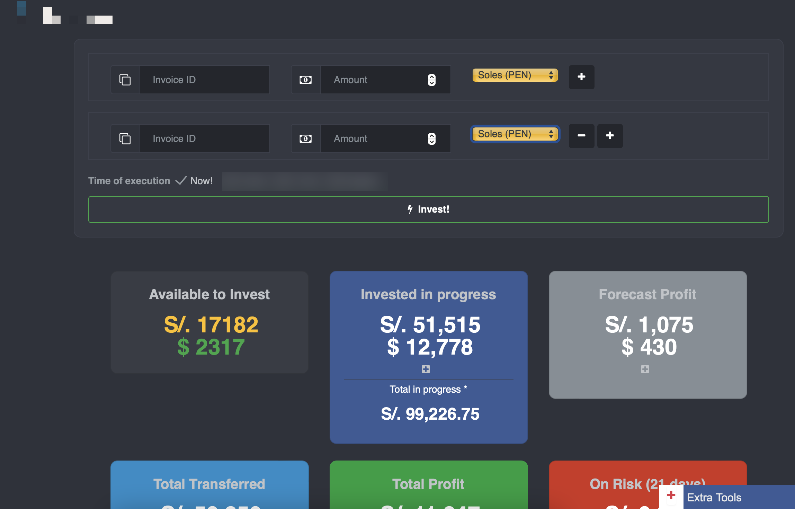
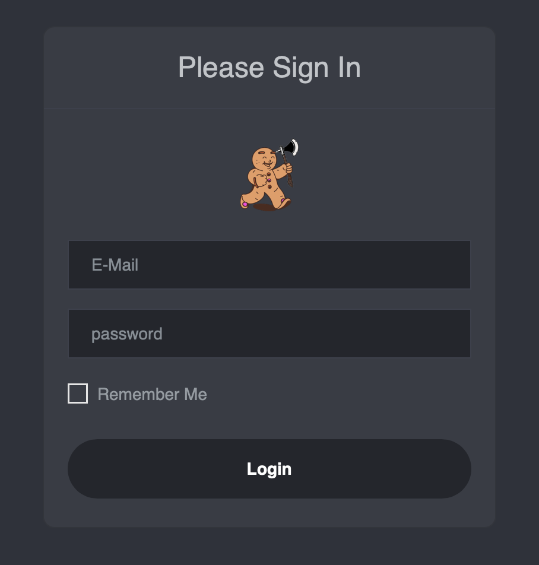
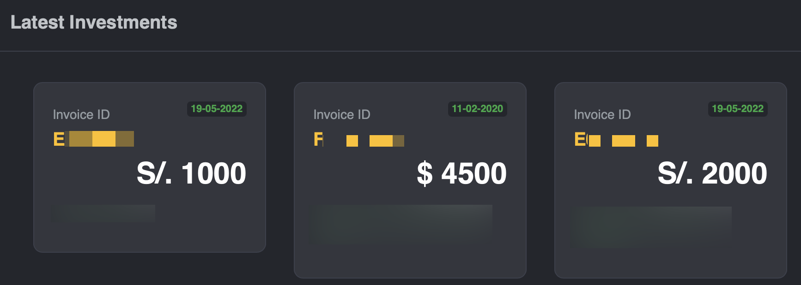
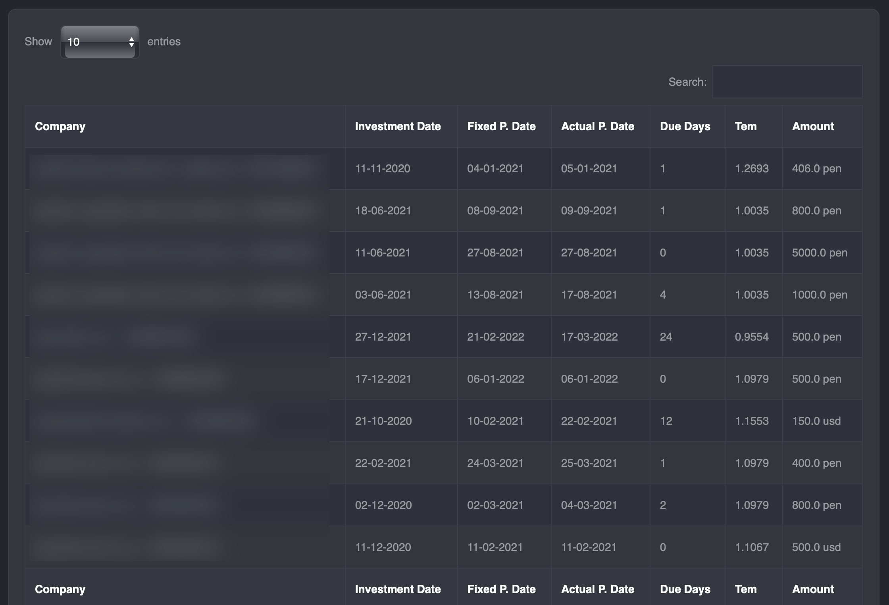
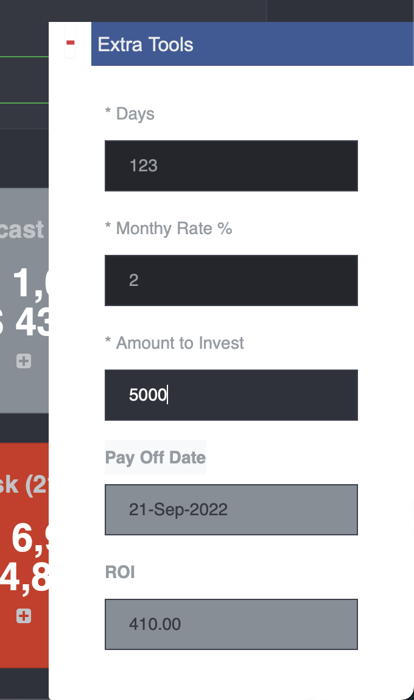

## Investment Web Application APP
**PUBLIC VERSION**

**Disclaimer:** The following code shown is an excerpt from the base private code of which I am the creator and owner. This code is not functional, its purpose is only to demonstrate what has been built.

**Business Case:** In the market there are a number of invoice investment platforms which require constant attention from investors in order to obtain the best investment options regarding profitability, security and investment time, where time is a factor. key since it requires the investor to be permanently attentive to the platforms. The purpose of this application is to eliminate the time of attention to the platforms where each investment to be made can be scheduled and even more, it offers the possibility of making investments in a preferential way.

**Design:** The web platform has a design that supports multiple investments simultaneously, each investment will be handled individually multi-threaded. The user must enter the ID of each investment to be made, which will be taken manually from the investment platform, the amount and currency to invest; You must also select the investment execution time, this varies according to each platform. This design was improved in the version for iOS where only is required to select the investment and the amount to be invested. 

**Limitations:** Initial design considers multithreaded work which depends on a processing task. This task does not run automatically, it just puts to sleep/wait at execution time which is not optimal for the use of cloud resources.

**Web App Summary:** This is a web application was created to invest on customer invoice selection target, handling:
- User CRUD operations to database managing security using Spring Boot Security
- Parallel Thread tasks execution to achieve the goal of the application
- Reports from historical data combining information from providers and database information
- Admin panel for user administration
- Frontend: JSP, Websockets, HTML, CSS, Javascript
- Backend: Java 11, Spring Boot, Maven, JpaRepository, PostgresSQL

**Dashboard and investment portal**

**Login page**

**Last Invesments Status**

**List of historical and current Invesments**

**Javascript ROI Calculator**

